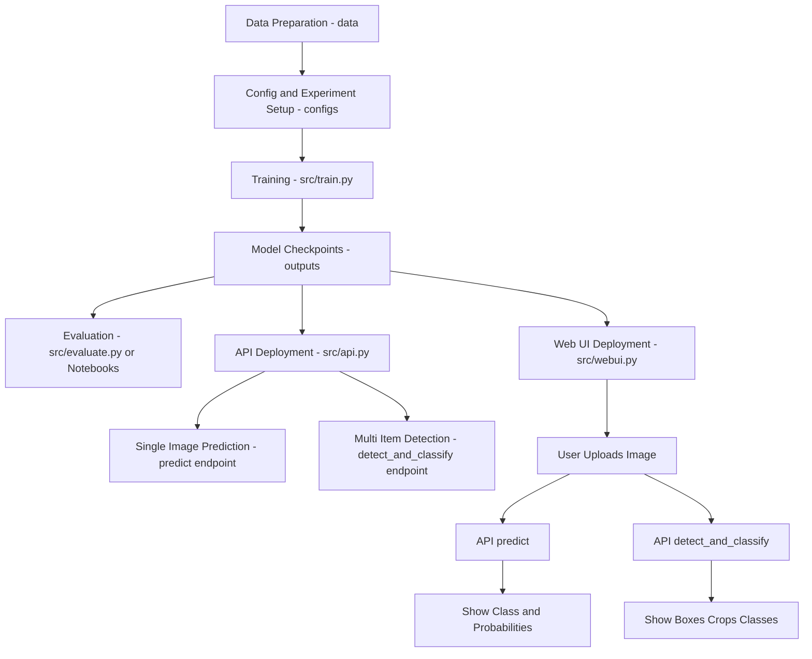

# Waste Image Classification Project

## Project Overview
A modular deep learning system for classifying waste images into multiple categories for recycling and waste management. Supports hierarchical and flat classification, semi-supervised learning, and both single-item and multi-item (object detection) modes via API and web UI.

## Architecture Diagram


## Features
- Modular data pipeline for multiple datasets (TrashNet, Garbage Classification, etc.)
- Baseline CNN and advanced models (ResNet50, EfficientNet-B0)
- Hierarchical and flat classification options
- Semi-supervised learning with pseudo-labeling
- Data augmentation and class imbalance handling
- Per-class and hierarchical evaluation metrics
- FastAPI web API for inference and detection
- Streamlit web UI for interactive use
- Multi-item detection and classification using YOLOv8
- Config-driven and reproducible experiments

## Project Structure
```
waste-classification/
│
├── data/                # Place for raw and processed datasets (see src/data/README.md)
├── configs/             # YAML configs for experiments (use any YAML here, e.g. baseline.yaml)
├── src/                 # Source code: data, models, training, API, UI
├── outputs/             # Model checkpoints (created during training)
├── requirements.txt     # Python dependencies (covers training, API, UI)
├── README.md            # Project overview and instructions
└── LICENSE
```

## Quickstart

### 1. Environment Setup
```bash
python3 -m venv venv
source venv/bin/activate
pip install -r requirements.txt
```

### 2. Data Preparation
- Download datasets (e.g., TrashNet, Kaggle, Garbage Classification) and place them in `data/`.
- Organize each dataset as:
  ```
  data/<dataset_name>/train/<class_name>/*.jpg
  data/<dataset_name>/val/<class_name>/*.jpg
  data/<dataset_name>/test/<class_name>/*.jpg  # Optional
  ```
- See `src/data/README.md` for dataset links, structure, tips, and license notes for each dataset.

#### Example: Using a Larger Dataset (e.g., Garbage Classification or Kaggle Waste)

1. **Download**
   - Go to the dataset page (e.g., [Garbage Classification on Papers With Code](https://paperswithcode.com/dataset/garbage-classification-dataset) or [Waste Classification on Kaggle](https://www.kaggle.com/datasets/techsash/waste-classification-data)).
   - Download the dataset archive (ZIP, TAR, etc.).

2. **Extract**
   - Extract the archive into the `data/` directory. For example, for Garbage Classification:
     ```bash
     unzip garbage_classification.zip -d data/
     ```
   - After extraction, you should have a folder such as `data/garbage_12/` or `data/waste_kaggle/` containing class subfolders or images.

3. **Organize Folders**
   - Ensure the folder structure matches:
     ```
     data/<dataset_name>/train/<class_name>/*.jpg
     data/<dataset_name>/val/<class_name>/*.jpg
     data/<dataset_name>/test/<class_name>/*.jpg  # Optional
     ```
   - If the dataset does not provide train/val/test splits, you can create them manually. Use scripts in `notebooks/` or write your own to split images by class.

4. **Update Config**
   - Edit or create a config YAML in `configs/` (e.g., `configs/garbage_12.yaml`).
   - Set:
     ```yaml
     data_source: folders
     data_dir: data/garbage_12
     classes: ["class1", "class2", ..., "classN"]  # List all class folder names
     ```
   - Make sure the `classes` list matches the subfolder names in your dataset.

5. **Train**
   - Run:
     ```bash
     python -m src.train --config configs/garbage_12.yaml
     ```

6. **Tips**
   - Double-check class names for typos or mismatches.
   - For large datasets, you may want to increase `batch_size` or adjust `num_workers` in your config.
   - If you encounter memory issues, try reducing `batch_size`.

### 3. Dataset Setup: HuggingFace TrashNet (Default)

By default, this project uses the TrashNet dataset via the HuggingFace Datasets library. This is fast, reproducible, and **requires no manual download or extraction**.

**Install the HuggingFace Datasets library (if not already installed):**
```bash
pip install datasets
```

**Default behavior:**
- If you do not specify a `data_source` in your config YAML, the code will automatically download and use the TrashNet dataset from HuggingFace on first run.

**To use a local folder dataset instead:**
- Set `data_source: folders` in your config YAML (e.g. `configs/baseline.yaml`).
- The expected folder structure is:
  ```
  data/trashnet/train/cardboard/
  data/trashnet/train/glass/
  ...
  data/trashnet/val/[same folders as above]
  data/trashnet/test/[same folders as above]
  ```

**Manual HuggingFace usage example:**
```python
from datasets import load_dataset

ds = load_dataset("garythung/trashnet")
```
- This will automatically download and prepare the dataset splits (`train`, `test`, `validation`).
- You can access images and labels directly from the `ds` object.

**Extending to new dataset sources:**
- The codebase uses a factory/adapter pattern for dataset loading.
- To add a new source, create a new `torch.utils.data.Dataset` adapter and add a block in `get_data_loaders_from_source` in `src/data/dataset.py`.
- Document the new source in your config and README.

For more details, see the [TrashNet dataset page on HuggingFace](https://huggingface.co/datasets/garythung/trashnet).

### 4. Configure Your Experiment
- Edit or create a YAML config in `configs/` (e.g., `baseline.yaml`).
- Set dataset path, class names, model type, batch size, epochs, etc.

### 5. Train a Model
```bash
python -m src.train --config configs/baseline.yaml
```
- You can use any YAML config in `configs/` (not just baseline.yaml)
- Optional CLI overrides:
```bash
python -m src.train --config configs/baseline.yaml --epochs 20 --batch_size 64
```

### 5. Evaluate the Model
```bash
python src/evaluate.py --checkpoint outputs/baseline_cnn.pth
```
- For deeper analysis (confusion matrix, per-class metrics), use your own Jupyter notebooks or scripts.

### 6. Semi-Supervised Learning
- Add unlabeled images to `data/unlabeled/`.
- Run pseudo-labeling:
```bash
python src/pseudo_label.py --config configs/pseudo_label.yaml
```

### 7. Experiment with Architectures
- Change `model` in config to `resnet50` or `efficientnet_b0` for transfer learning.
- Experiment with augmentation, batch size, learning rate, etc.

## Supported Datasets
- TrashNet (~2.5k, 6 classes)
- Garbage Classification (12-class, ~15k)
- Waste Classification Kaggle (2–3 classes, ~25k)
- OpenLitterMap (large-scale, multi-label)

## Model Zoo
- Baseline CNN (from scratch)
- ResNet50 (transfer learning)
- EfficientNet-B0 (transfer learning)
- (Vision Transformer support can be added)

## Evaluation
- Per-class accuracy, precision, recall
- Confusion matrix
- Hierarchical accuracy

## How to Extend
- **Add a dataset:**
  1. Download and extract the dataset to `data/<dataset_name>/`.
  2. Split into `train/`, `val/`, and (optionally) `test/` folders per class.
  3. Update or create a YAML config in `configs/` with the correct `data_source`, `data_dir`, and `classes` list.
  4. Run training as described above.
  5. If your dataset structure is different or you need custom logic, extend `src/data/dataset.py` with a new adapter class and update `get_data_loaders_from_source`.
- **Add a model:** Add to `src/models/`, update training script if needed.
- **Add metrics:** Extend `src/train.py` or use your own analysis scripts.
- **Add experiments:** Create new YAML config files in `configs/`.

## Troubleshooting & Tips
- Check data structure and config if you get missing class or dataset errors.
- Check logs/warnings for corrupt images or missing folders.
- Always set a random seed in your config for reproducibility.
- All dependencies are in `requirements.txt`.

## Where to Find What
- **Data loading & augmentation:** `src/data/dataset.py`
- **Model architectures:** `src/models/`
- **Training loop:** `src/train.py`
- **Configs:** `configs/`
- **API:** `src/api.py`
- **Web UI:** `src/webui.py`
- **Data README:** `src/data/README.md`

---

## Using the Web API
Serve your trained model as a web API using FastAPI.

### 1. Install API Dependencies
All required packages are in `requirements.txt` (including fastapi, uvicorn, pillow, pyyaml, ultralytics).

### 2. Ensure Model Weights and Config are Available
- Place trained model weights (e.g., `outputs/resnet50_best.pth`) and config (e.g., `configs/baseline.yaml`) in the appropriate locations.
- Both the API and web UI require these files to be present and correctly referenced.
- Switch models by editing `MODEL_TYPE` and `MODEL_PATH` in `src/api.py`.
- Note: YOLOv8 weights (`yolov8n.pt`) are auto-downloaded by ultralytics the first time detection is run.

### 3. Start the API Server
```bash
uvicorn src.api:app --reload --port 8001
```

### 4. API Endpoints

#### `/predict` (POST)
- Upload a single image file and get predicted class and probabilities.
- Example:
```bash
curl -X POST "http://127.0.0.1:8001/predict" -F "file=@yourimage.jpg"
```
- Response:
```json
{
  "predicted_label": "plastic",
  "probability": 0.98,
  "class_probs": {"plastic": 0.98, ...}
}
```

#### `/detect_and_classify` (POST)
- Upload an image with multiple waste items. Returns bounding boxes, predicted classes, probabilities, and base64-encoded crops.
- Example:
```bash
curl -X POST "http://127.0.0.1:8001/detect_and_classify" -F "file=@yourimage.jpg"
```
- Response includes detection results and image with bounding boxes.

---

## Using the Web UI
A user-friendly web interface for classifying images with your trained models. Both single-item and multi-item detection/classification are supported out of the box.

### 1. Start the FastAPI Backend
```bash
uvicorn src.api:app --reload --port 8001
```

### 2. Install UI Dependencies
```bash
pip install -r requirements.txt
```

### 3. Launch the Streamlit Web UI
```bash
streamlit run src/webui.py
```

### 4. Use the Interface
- Upload an image and click "Classify Image" (single item) or "Detect & Classify Items" (multi-item).
- View predictions, class probabilities, bounding boxes, and download cropped items.

#### How it Works
- The web UI sends your image to the FastAPI backend at `/predict` or `/detect_and_classify`.
- The backend returns results, which are displayed in the UI.

#### Customization
- Change the API endpoint in `src/webui.py` if needed.
- Extend UI with model selection, batch upload, or result history.

---

## Detecting and Classifying Multiple Waste Items
- The web UI and API support detection and classification of multiple waste items in a single image using YOLOv8. No extra setup is required.
- Results include bounding boxes, cropped images, predicted classes, and download options.

---
1. Start the FastAPI backend:
   ```bash
   uvicorn src.api:app --reload --port 8001
   ```
2. Launch the Streamlit UI:
   ```bash
   streamlit run src/webui.py
   ```
3. Select "Detect & Classify Multiple Items" in the sidebar.
4. Upload your image and click "Detect & Classify Items".
5. View, inspect, and download results directly from the UI!

---

## References
- [TrashNet Dataset](https://github.com/GaryThung/trashnet)
- [Garbage Classification Dataset](https://paperswithcode.com/dataset/garbage-classification-dataset)
- [OpenLitterMap](https://openlittermap.com/)
- [OpenLitterMap](https://openlittermap.com/)

---

For detailed documentation, see comments in each module and the notebooks for examples.

Happy experimenting and extending your waste classification project!
